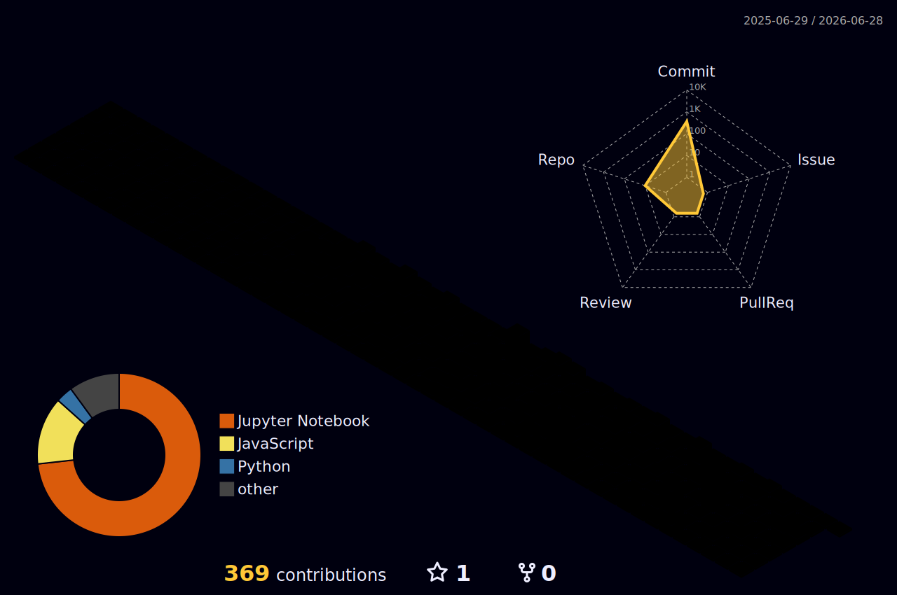

<h1 align="center">Hi 👋, I'm Budhadev Das</h1>

<h3 align="center">
🚀 AI/ML Enthusiast | ML/DL Developer | Python & React Developer
</h3>

<p align="center">
  
</p>

---

# 🌐 Connect With Me

<p align="center">

<a href="https://www.linkedin.com/in/budhadev-das-002689199/" target="_blank">

</a>

<a href="https://github.com/Mikun007" target="_blank">

</a>

<a href="mailto:mikundas2000@gmail.com">

</a>

</p>

---

# 💻 Tech Stack

<p align="center">


</p>

---

# 🏆 GitHub Trophies

<p align="center">
  
</p>

---

# 📊 GitHub Stats

<p align="center">


</p>

---

# 🔥 GitHub Streak

<p align="center">
  
</p>

---

# 📈 GitHub Activity Graph

<p align="center">
  
</p>

---

# 🐍 Snake Eating Contributions

<p align="center">
  
</p>

---

# 🌌 3D Contribution Graph

<p align="center"> 
   
</p>

---

# 🚀 Current Focus

```python
Learning = [
    "GenAI",
    "LLM Applications",
    "LangGraph",
    "AI Agents",
    "MLOps",
    "System Design"
]

Building = [
    "AI Chatbots",
    "ML Projects",
    "Flask APIs",
    "Full Stack Applications"
]
````

---

# ⚡ Fun Fact

```yaml
I turn coffee ☕ into AI models 🤖
```

---

# 👀 Profile Views

<p align="center">
  
</p>

---

<h2 align="center">
⭐ Thanks for visiting my profile ⭐
</h2>

